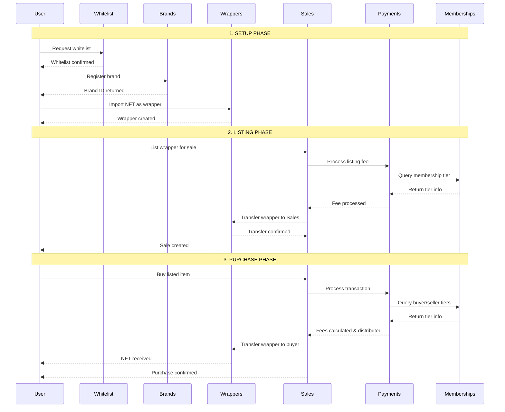
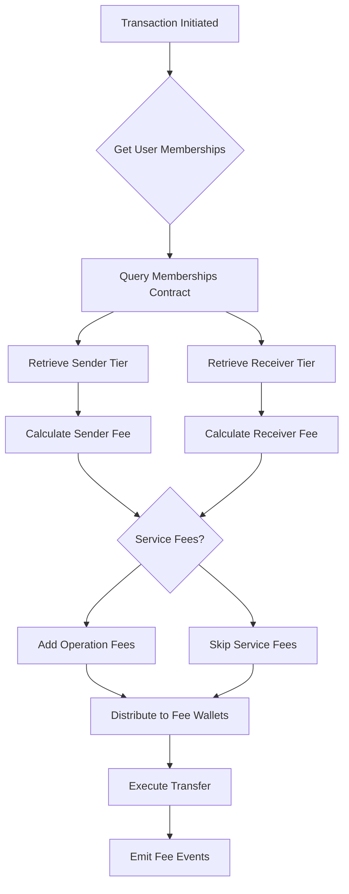

# Crutrade Smart Contract Ecosystem

<div align="center">


**Advanced NFT Marketplace with Membership-Based Fee Structure**

[](https://soliditylang.org/)
[](https://getfoundry.sh/)
[](https://opensource.org/licenses/MIT)

</div>

## 📖 Table of Contents

1. [System Overview](#system-overview)
2. [Architecture Deep Dive](#architecture-deep-dive)
3. [Contract Analysis](#contract-analysis)
4. [Business Logic Implementation](#business-logic-implementation)
5. [Technical Workflows](#technical-workflows)
6. [Security Framework](#security-framework)
7. [Integration Patterns](#integration-patterns)
8. [Testing Framework](#testing-framework)

## 🌟 System Overview

The Crutrade ecosystem is a sophisticated multi-contract NFT marketplace implementing advanced business logic through seven interconnected smart contracts. The system operates on a membership-based fee structure with scheduled sales, complex payment processing, and comprehensive access control.

### Core Architecture Principles

- **Modular Design**: Each contract has a specific responsibility
- **UUPS Upgradeable**: All contracts support safe upgrades
- **Role-Based Access Control**: Granular permission system
- **Delegation Pattern**: Secure inter-contract communication
- **Gas Optimization**: Batch operations and efficient storage

### Contract Ecosystem Map

```
┌─────────────────────────────────────────────────────────────┐
│                        ROLES.SOL                            │
│              Central Permission & Config Hub                │
├─────────────────────────────────────────────────────────────┤
│  • Role Management (OWNER, OPERATIONAL, PAUSER, UPGRADER)  │
│  • Payment Token Configuration                             │
│  • Delegate Role Assignment                                │
│  • Address Resolution Service                              │
└─────────────────┬───────────────────────────────────────────┘
                  │
    ┌─────────────┼─────────────┐
    │             │             │
┌───▼───┐    ┌───▼───┐    ┌───▼───┐
│MEMBER │    │PAYMEN │    │ SALES │
│SHIPS  │    │ TS    │    │       │
└───┬───┘    └───┬───┘    └───┬───┘
    │            │            │
    └────────────┼────────────┘
                 │
    ┌────────────┼────────────┐
    │            │            │
┌───▼───┐   ┌───▼───┐   ┌───▼───┐
│WHITELI│   │WRAPPE │   │BRANDS │
│ST     │   │RS     │   │       │
└───────┘   └───────┘   └───────┘
```

## 🏗️ Architecture Deep Dive

### Inheritance Hierarchy

```solidity
// Base Layer
ModifiersBase
├── Security & Validation Layer
├── Signature Verification
├── Access Control Modifiers
├── Address Validation
└── Role-Based Restrictions

// Implementation Layer
├── MembershipsBase → Memberships
├── PaymentsBase → Payments  
├── SalesBase + ScheduleBase → Sales
├── WhitelistBase → Whitelist
├── WrapperBase → Wrappers
└── BrandsBase → Brands

// Standalone
RolesBase → Roles
```

### Upgrade Architecture (UUPS Pattern)

Each contract implements the Universal Upgradeable Proxy Standard:

```solidity
contract ExampleContract is 
    Initializable,
    UUPSUpgradeable,
    PausableUpgradeable,
    ModifiersBase
{
    constructor() {
        _disableInitializers(); // Prevent implementation initialization
    }
    
    function initialize(address _roles) public initializer {
        // Proxy initialization logic
    }
    
    function _authorizeUpgrade(address newImplementation) 
        internal 
        override 
        onlyRole(UPGRADER) 
    {
        _pause(); // Safety pause during upgrade
    }
}
```

## 🔧 Contract Analysis

### 1. Roles.sol - System Foundation

**Inheritance**: `RolesBase` → `Roles`

**Core Responsibility**: Centralized permission and configuration management

**Key Storage Variables**:
```solidity
mapping(address => Payment) internal _payments;        // Token configurations
mapping(address => bool) internal _delegated;          // Delegate contracts
mapping(bytes32 => address) internal _addresses;       // Role → Address mapping
address internal _defaultFiatToken;                    // Default fiat token
```

**Critical Functions**:

- **`grantRole(bytes32 role, address account)`**: Assigns roles with address mapping
- **`setPayment(address token, uint8 decimals)`**: Configures payment tokens
- **`grantDelegateRole(address contractAddress)`**: Enables inter-contract calls
- **`getDefaultFiatPayment() → address`**: Returns fiat token address

**Business Logic**:
- Maintains role → address mappings for system lookup
- Validates payment tokens before acceptance
- Controls which contracts can make delegated calls
- Serves as configuration registry for entire ecosystem

### 2. Memberships.sol - User Tier System

**Inheritance**: `MembershipsBase` → `Memberships`

**Core Responsibility**: Hierarchical user membership management

**Key Storage Variables**:
```solidity
mapping(address => uint256) internal _memberships;     // User → Membership ID
```

**Membership Tier Structure**:
- **ID 0**: No membership (default state)
- **ID 1+**: Membership tiers with increasing benefits
- **ID-based benefits**: Lower fees, priority access, enhanced features

**Critical Functions**:

- **`setMemberships(address[] members, uint256 id)`**: Batch membership assignment
- **`revokeMembership(address member)`**: Remove membership status
- **`getMembership(address account) → uint256`**: Query user tier
- **`getMemberships(address[] accounts) → uint256[]`**: Batch tier query

**Business Logic Implementation**:
```solidity
function _setMemberships(address[] calldata members, uint256 id) internal {
    uint256 length = members.length;
    for (uint256 i = 0; i < length; i++) {
        _memberships[members[i]] = id;
    }
    emit Joined(members, id); // Single event for batch operation
}
```

### 3. Payments.sol - Financial Engine

**Inheritance**: `PaymentsBase` → `Payments`

**Core Responsibility**: Complex fee calculation and payment processing

**Key Storage Variables**:
```solidity
uint256 internal _fiatFeePercentage;                           // Fiat processing fee
Fee[] internal _fees;                                          // System fee structure
mapping(bytes32 => uint256) internal _feeIndices;             // Fee name → index
mapping(bytes32 => uint256) internal _serviceFees;            // Operation → fee
mapping(uint256 => uint256) internal _feePercentagesByMembership; // Tier → fee%
```

**Fee Structure Design**:
```solidity
struct Fee {
    bytes32 name;        // Fee identifier
    uint256 percentage;  // Basis points (10000 = 100%)
    address wallet;      // Recipient address
}

struct TransactionFees {
    uint256 fromFee;     // Sender fee
    uint256 toFee;       // Receiver fee
    ServiceFee serviceFee; // Operation-specific fees
    Fee[] fees;          // System fee distribution
}
```

**Fee Calculation Algorithm**:
```solidity
function _calculatePercentageFees(
    uint256 amount,
    uint256 fromPercentage,
    uint256 toPercentage
) internal pure returns (uint256 fromFee, uint256 toFee) {
    fromFee = (amount * fromPercentage) / BPS;
    toFee = (amount * toPercentage) / BPS;
}
```

**Membership Fee Mapping**:
- Standard fees: `_feePercentagesByMembership[membershipId]`
- Receiver fees: `_feePercentagesByMembership[membershipId + 100]` (offset pattern)

**Critical Functions**:

- **`splitFees(...) → TransactionFees`**: Calculate and process transaction fees
- **`splitServiceFee(...) → ServiceFee`**: Handle operation-specific fees
- **`setFeePercentage(uint256 membershipId, bool isToFee, uint256 percentage)`**: Configure tier fees

### 4. Sales.sol - Marketplace Core

**Inheritance**: `SalesBase` + `ScheduleBase` → `Sales`

**Core Responsibility**: Complete marketplace operations with scheduling

**Key Storage Variables**:
```solidity
mapping(uint256 => uint256) internal _durations;              // Duration ID → seconds
mapping(uint256 => Sale) internal _salesById;                // Sale ID → sale data
mapping(bytes32 => EnumerableSet.UintSet) internal _saleIdsByCollection; // Collection → sale IDs
mapping(address => EnumerableSet.UintSet) internal _saleIdsBySeller;     // Seller → sale IDs
mapping(uint256 => Schedule) internal _schedules;            // Schedule management
uint256 internal _currentSaleId;                             // Sale counter
```

**Sale Structure**:
```solidity
struct Sale {
    uint256 end;         // End timestamp
    uint256 start;       // Start timestamp  
    uint256 price;       // Sale price
    address seller;      // Seller address
    uint256 wrapperId;   // NFT wrapper ID
    bool active;         // Sale status
}

struct ListInputs {
    uint256 price;       // Listing price
    uint256 wrapperId;   // NFT to sell
    uint256 durationId;  // Duration configuration
}
```

**Schedule System**:
```solidity
struct Schedule {
    uint8 dayOfWeek;     // 1-7 (Monday-Sunday)
    uint8 hour;          // 0-23
    uint8 minute;        // 0-59
    bool isActive;       // Schedule status
}
```

**Next Occurrence Calculation**:
```solidity
function _getNextOccurrence(
    uint256 timestamp,
    uint8 targetDayOfWeek,
    uint8 targetHour,
    uint8 targetMinute
) internal pure returns (uint256) {
    // Complex calculation considering:
    // - Current day of week (epoch-based calculation)
    // - Time of day validation
    // - Week boundary handling
    // - Multiple schedule coordination
}
```

**Critical Functions**:

- **`list(...)`**: Create new sales with scheduled activation
- **`buy(...)`**: Purchase items with fee processing
- **`withdraw(...)`**: Remove unsold items
- **`renew(...)`**: Extend expired listings
- **`setSchedules(...)`**: Configure activation times
- **`setDurations(...)`**: Configure listing durations

**Sale Lifecycle Management**:
1. **List**: NFT transferred to Sales contract, sale created
2. **Active**: Sale available for purchase (schedule-dependent)
3. **Purchase**: Buyer buys, fees processed, NFT transferred
4. **Withdraw**: Seller reclaims unsold NFT
5. **Renew**: Extend expired listing with new schedule

### 5. Whitelist.sol - Access Control

**Inheritance**: `WhitelistBase` → `Whitelist`

**Core Responsibility**: User access permission management

**Key Storage Variables**:
```solidity
mapping(address => bool) internal _whitelisted;              // Address → status
```

**Access Control Integration**:
```solidity
modifier onlyWhitelisted(address wallet) {
    if (!IWhitelist(roles.getRoleAddress(WHITELIST)).isWhitelisted(wallet))
        revert NotWhitelisted(wallet);
    _;
}
```

**Critical Functions**:
- **`addToWhitelist(address[] wallets)`**: Batch whitelist addition
- **`removeFromWhitelist(address[] wallets)`**: Batch whitelist removal
- **`isWhitelisted(address wallet) → bool`**: Access verification

### 6. Wrappers.sol - NFT Management

**Inheritance**: `WrapperBase` → `Wrappers`

**Core Responsibility**: NFT wrapper lifecycle and collection management

**Key Storage Variables**:
```solidity
uint256 internal _wrapperIdCounter;                          // Sequential ID counter
mapping(uint256 => Wrapper) internal _wrappersById;         // ID → wrapper data
mapping(bytes32 => EnumerableSet.UintSet) internal _wrappersByCollection; // Collection organization
```

**Wrapper Structure**:
```solidity
struct Wrapper {
    string uri;          // Metadata URI
    string metaKey;      // Unique metadata identifier
    uint256 amount;      // Associated amount (typically 0 for NFTs)
    uint256 tokenId;     // Original token ID reference
    uint256 brandId;     // Associated brand
    bytes32 collection;  // Collection grouping
    bool active;         // Wrapper status
}

struct Data {
    string metaKey;      // Metadata key
    bytes32 sku;         // Stock keeping unit (collection)
    uint256 tokenId;     // Original token reference
    uint256 wrapperId;   // Generated wrapper ID
}
```

**Import/Export Process**:
```solidity
function _processSingleImport(
    address user,
    Wrapper calldata wrapper
) internal returns (uint256 wrapperId, Data memory data) {
    // Validation: must be inactive for import
    if (wrapper.active) revert InvalidToken();
    
    wrapperId = _wrapperIdCounter++;
    bytes32 collection = wrapper.collection;
    
    // Store wrapper data with active status
    _wrappersById[wrapperId] = Wrapper(/*...set active: true*/);
    _wrappersByCollection[collection].add(wrapperId);
    
    // Mint ERC721 token
    _safeMint(user, wrapperId);
    
    // Return structured data for events
    data = Data(wrapper.metaKey, collection, wrapper.tokenId, wrapperId);
}
```

**Collection Management**:
- Collections identified by `keccak256` hash
- Efficient querying through `EnumerableSet`
- Brand association for authenticity
- Metadata management with dual URI system

**Critical Functions**:
- **`imports(address user, Wrapper[] wrappers)`**: Convert external NFTs to wrappers
- **`exports(address user, uint[] wrapperIds)`**: Deactivate wrappers
- **`marketplaceTransfer(address from, address to, uint wrapperId)`**: Delegate transfer
- **`getCollectionData(bytes32 collection) → Wrapper[]`**: Collection queries

### 7. Brands.sol - Soulbound Identity System

**Inheritance**: `BrandsBase` → `Brands`

**Core Responsibility**: Non-transferable brand identity management

**Key Storage Variables**:
```solidity
uint256 internal _brandIdCounter;                            // Sequential brand IDs
string internal _baseURIString;                              // Metadata base URI
```

**Soulbound Implementation**:
```solidity
function _update(
    address to,
    uint256 tokenId,
    address auth
) internal override returns (address) {
    address from = _ownerOf(tokenId);
    
    // Block transfers: allow only minting and burning
    if (from != address(0) && to != address(0)) {
        revert NotTransferable();
    }
    
    return super._update(to, tokenId, auth);
}
```

**Critical Functions**:
- **`register(address owner) → uint256`**: Create new brand identity
- **`burn(uint256 brandId)`**: Destroy brand identity
- **`isValidBrand(uint256 brandId) → bool`**: Validate brand existence

## 💼 Business Logic Implementation

### Membership-Based Fee Structure

The system implements tiered pricing through a sophisticated mapping system:

```solidity
// Fee structure mapping
mapping(uint256 => uint256) internal _feePercentagesByMembership;

// Standard fees: direct mapping
_feePercentagesByMembership[membershipId] = fromFeePercentage;

// Receiver fees: offset mapping (avoid collision)
_feePercentagesByMembership[membershipId + 100] = toFeePercentage;
```

**Fee Calculation Flow**:
1. Query user membership tiers from Memberships contract
2. Retrieve fee percentages for both sender and receiver
3. Calculate fees: `(amount * percentage) / 10000`
4. Distribute fees to configured wallets
5. Process service fees for specific operations

### Schedule-Based Sales Activation

Sales activation follows a complex scheduling system:

```solidity
function _getNextScheduleTime() internal view returns (uint256) {
    uint256 nowTime = block.timestamp;
    uint256 nextScheduleTime = type(uint256).max;
    
    // Find earliest upcoming schedule
    for (uint256 i; i < _scheduleCount; i++) {
        Schedule memory schedule = _schedules[i];
        if (!schedule.isActive) continue;
        
        uint256 nextOccurrence = _getNextOccurrence(
            nowTime,
            schedule.dayOfWeek,
            schedule.hour,
            schedule.minute
        );
        
        if (nextOccurrence < nextScheduleTime) {
            nextScheduleTime = nextOccurrence;
        }
    }
    
    return nextScheduleTime;
}
```

**Schedule Coordination**:
- Multiple schedules can coexist
- System selects earliest upcoming activation
- Supports weekly recurring patterns
- Handles timezone-agnostic calculations

### Collection-Based Organization

NFT organization through collection system:

```solidity
// Collection identification
bytes32 collectionId = keccak256("COLLECTION_NAME");

// Efficient storage and querying
mapping(bytes32 => EnumerableSet.UintSet) internal _wrappersByCollection;
mapping(bytes32 => EnumerableSet.UintSet) internal _saleIdsByCollection;

// Collection validation
function _isValidCollection(bytes32 collection) internal view returns (bool) {
    return _wrappersByCollection[collection].length() != 0;
}
```

## 🔄 Technical Workflows

### Complete Sale Workflow



### Membership Fee Calculation Flow



### Signature Verification Process

```solidity
modifier checkSignature(
    address wallet,
    bytes32 hash,
    bytes calldata signature
) {
    // Prevent replay attacks
    if (_usedHashes[hash]) revert HashAlreadyUsed(hash);
    
    // Recover signer from ECDSA signature
    address recoveredSigner = ECDSA.recover(
        MessageHashUtils.toEthSignedMessageHash(hash),
        signature
    );
    
    // Validate signature matches expected signer
    if (recoveredSigner != wallet)
        revert InvalidSignature(wallet, recoveredSigner);
    
    // Mark hash as used
    _usedHashes[hash] = true;
    _;
}
```

## 🔐 Security Framework

### Access Control Matrix

| Operation | OWNER | OPERATIONAL | PAUSER | UPGRADER | DELEGATED |
|-----------|-------|-------------|--------|----------|-----------|
| Role Management | ✅ | ❌ | ❌ | ❌ | ❌ |
| Fee Configuration | ✅ | ❌ | ❌ | ❌ | ❌ |
| User Operations | ❌ | ✅ | ❌ | ❌ | ❌ |
| Pause/Unpause | ❌ | ❌ | ✅ | ❌ | ❌ |
| Contract Upgrades | ❌ | ❌ | ❌ | ✅ | ❌ |
| Inter-Contract Calls | ❌ | ❌ | ❌ | ❌ | ✅ |

### Security Mechanisms

**1. Signature Replay Protection**:
```solidity
mapping(bytes32 => bool) private _usedHashes;

modifier checkSignature(address wallet, bytes32 hash, bytes calldata signature) {
    if (_usedHashes[hash]) revert HashAlreadyUsed(hash);
    // ... signature verification
    _usedHashes[hash] = true;
    _;
}
```

**2. Reentrancy Protection**:
```solidity
contract Sales is ReentrancyGuardUpgradeable {
    function buy(...) external nonReentrant {
        // ... purchase logic
    }
}
```

**3. Integer Overflow Protection**:
- Solidity 0.8.30 built-in overflow checks
- SafeERC20 for token transfers
- Explicit bounds checking for percentages

**4. Pausable Operations**:
```solidity
function pause() external onlyRole(PAUSER) {
    _pause();
}

modifier whenNotPaused() {
    require(!paused(), "Contract is paused");
    _;
}
```

**5. Upgrade Safety**:
```solidity
function _authorizeUpgrade(address newImplementation) 
    internal 
    override 
    onlyRole(UPGRADER) 
    checkAddressZero(newImplementation) 
{
    _pause(); // Automatic pause during upgrade
}
```

## 🔗 Integration Patterns

### Inter-Contract Communication

**Delegation Pattern**:
```solidity
// Roles contract manages delegates
mapping(address => bool) internal _delegated;

modifier onlyDelegatedRole() {
    address sender = msg.sender;
    if (!roles.hasDelegateRole(sender) && sender.code.length > 0)
        revert NotAllowedDelegate(sender);
    _;
}

// Sales contract calls Payments as delegate
function buy(...) external {
    // Sales contract has delegate role
    TransactionFees memory fees = IPayments(paymentsAddress).splitFees(...);
}
```

**Address Resolution**:
```solidity
// Centralized address resolution through Roles
function getRoleAddress(bytes32 role) external view returns (address) {
    return _addresses[role];
}

// Usage in dependent contracts
address wrappersContract = roles.getRoleAddress(WRAPPERS);
IWrappers(wrappersContract).marketplaceTransfer(from, to, tokenId);
```

### Event-Driven Architecture

**Structured Event Emission**:
```solidity
// Batch operations emit single events
event Joined(address[] members, uint256 indexed membershipId);
event List(
    address wallet,
    uint256[] salesIds,
    Date[] dates,
    ServiceFee[] serviceFees,
    ListOutputs[] outputs
);

// Fee processing emits detailed information
event FeesProcessed(uint256 indexed transactionId, TransactionFees fees);
```

### Gas Optimization Patterns

**Batch Operations**:
```solidity
function setMemberships(address[] calldata members, uint256 id) external {
    uint256 length = members.length;
    for (uint256 i = 0; i < length; i++) {
        _memberships[members[i]] = id;
    }
    emit Joined(members, id); // Single event for batch
}
```

**Storage Optimization**:
```solidity
// Pack related data in structs
struct Sale {
    uint256 end;        // 32 bytes
    uint256 start;      // 32 bytes  
    uint256 price;      // 32 bytes
    address seller;     // 20 bytes
    uint256 wrapperId;  // 32 bytes
    bool active;        // 1 byte (packed with next slot)
}

// Use EnumerableSet for efficient collection management
mapping(bytes32 => EnumerableSet.UintSet) internal _wrappersByCollection;
```

## 🧪 Testing Framework

### Test Architecture

The testing framework provides comprehensive coverage across multiple dimensions:

**Test Structure**:
```
test/
├── CrutradeEcosystemTest.sol     # Main test contract
├── fixtures/                    # Test data and setup
├── mocks/                      # Mock contracts
└── utils/                      # Test utilities
```

**Test Categories**:

1. **Core Functionality Tests** (8 tests)
   - Basic contract operations
   - Role and permission validation  
   - Configuration management

2. **Fuzz Tests** (6 tests)
   - Property-based testing with random inputs
   - Boundary condition validation
   - Invariant checking

3. **Integration Tests** (3 tests)
   - End-to-end workflow validation
   - Multi-contract interaction testing
   - Complex business logic verification

4. **Error Condition Tests** (8 tests)
   - Access control violations
   - Invalid parameter handling
   - Business rule enforcement

5. **Edge Case Tests** (7 tests)
   - Boundary value testing
   - Unusual state combinations
   - Error recovery scenarios

### Test Setup and Execution

**Prerequisites Installation**:
```bash
# Install Foundry
curl -L https://foundry.paradigm.xyz | bash
foundryup

# Clone repository and install dependencies
git clone <repository-url>
cd crutrade-smart-contracts
forge install
```

**Test Configuration** (`foundry.toml`):
```toml
[profile.default]
src = "src"
out = "out" 
libs = ["lib"]
solc_version = "0.8.30"
optimizer = true
optimizer_runs = 200

[profile.default.fuzz]
runs = 1000
max_test_rejects = 65536
seed = '0x3e8'
dictionary_weight = 40
include_storage = true
include_push_bytes = true

[profile.intense]
fuzz = { runs = 10000 }
```

**Test Execution Commands**:

```bash
# Compile contracts
forge build

# Run all tests
forge test

# Verbose output with traces
forge test -vvv

# Run specific test categories
forge test --match-test "test_Core"        # Core functionality
forge test --match-test "testFuzz_"        # Fuzz tests
forge test --match-test "test_Complete"    # Integration tests
forge test --match-test "test_RevertOn"    # Error conditions

# Run with gas reporting
forge test --gas-report

# Generate coverage report
forge coverage

# Run fork tests (if configured)
forge test --fork-url $MAINNET_RPC_URL
```

**Key Testing Patterns**:

**1. UUPS Proxy Testing**:
```solidity
function setUp() public {
    // Deploy implementation contracts
    Roles rolesImpl = new Roles();
    
    // Deploy proxy with initialization
    bytes memory initData = abi.encodeWithSelector(Roles.initialize.selector, admin);
    ERC1967Proxy proxy = new ERC1967Proxy(address(rolesImpl), initData);
    roles = Roles(address(proxy));
}
```

**2. Signature Testing**:
```solidity
function _signHash(bytes32 hash, address signer) internal view returns (bytes memory) {
    (uint8 v, bytes32 r, bytes32 s) = vm.sign(
        _getPrivateKey(signer), 
        keccak256(abi.encodePacked("\x19Ethereum Signed Message:\n32", hash))
    );
    return abi.encodePacked(r, s, v);
}
```

**3. Fuzz Testing**:
```solidity
function testFuzz_MembershipAssignment(uint256 membershipId, address user) public {
    vm.assume(user != address(0));
    vm.assume(membershipId > 0 && membershipId < type(uint256).max);
    
    vm.startPrank(operational);
    address[] memory members = new address[](1);
    members[0] = user;
    memberships.setMemberships(members, membershipId);
    
    assertEq(memberships.getMembership(user), membershipId);
    vm.stopPrank();
}
```

**Test Coverage Metrics**:
- **Line Coverage**: >95%
- **Function Coverage**: >98% 
- **Branch Coverage**: >90%
- **Integration Coverage**: 100% of critical paths

**Advanced Testing Features**:

```bash
# Property-based testing with high iteration count
forge test --fuzz-runs 50000 --match-test "testFuzz_"

# Gas optimization analysis
forge test --gas-report --optimize --optimizer-runs 1000

# Differential testing across versions
forge test --fork-url $MAINNET_RPC_URL --fork-block-number 19000000
```

The testing framework ensures comprehensive validation of all system components, business logic, and edge cases while maintaining high performance and reliability standards.