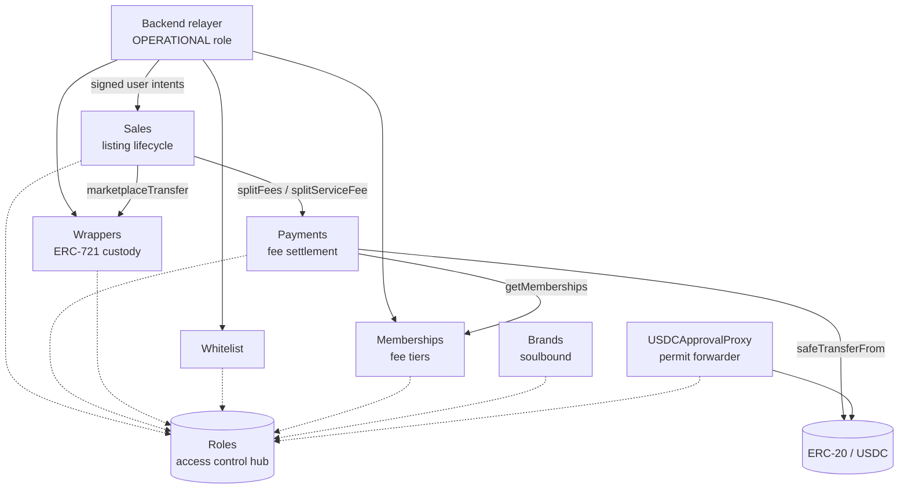

# 01 — Overview

CruTrade is a marketplace for physical luxury goods. Each physical item is represented on-chain by a
"wrapper" ERC-721 token minted by `src/Wrappers.sol`. Sellers list a wrapper through `src/Sales.sol`,
buyers pay in an ERC-20 token (USDC in production) settled by `src/Payments.sol`, and the wrapper
changes hands. Every participant must be whitelisted, and every user-initiated action is an EIP-712
signature relayed on-chain by a backend account holding the `OPERATIONAL` role. The repository also
publishes an npm package (`@crutrade/contracts`) carrying the ABIs, deployed addresses and TypeChain
types so backend and frontend code can integrate without duplicating artifacts.

Last verified against commit: 136615be21009eb2ea72a249527f07e2c1c61ab3

## Domain model

| Term | On-chain representation |
| --- | --- |
| Item | Wrapper NFT, `IWrappers.WrapperData` in `src/interfaces/IWrappers.sol` |
| Collection / SKU | `bytes32 collection` grouping wrappers, `_wrappersByCollection` in `src/abstracts/WrapperBase.sol` |
| Brand | Soulbound ERC-721 token in `src/Brands.sol` |
| Listing | `ISales.Sale` in `src/interfaces/ISales.sol`, keyed by an incrementing `saleId` |
| Membership tier | `uint256` id per address in `src/Memberships.sol`, driving fees in `src/Payments.sol` |
| Drop window | Weekly `Schedule` in `src/abstracts/ScheduleBase.sol` that sets when a listing goes live |

## Networks

| Network | Chain id | USDC | Source |
| --- | --- | --- | --- |
| Avalanche mainnet | 43114 | `0xB97EF9Ef8734C71904D8002F8b6Bc66Dd9c48a6E` | `script/network-config.ts` |
| Avalanche Fuji | 43113 | `0x5425890298aed601595a70AB815c96711a31Bc65` | `script/network-config.ts` |
| Anvil (local) | 31337 | `MockUSDC` deployed at runtime | `script/deploy.s.sol`, `runLocal()` |

Deployed proxy addresses for mainnet and testnet are in the generated `index.ts`.

## High-level architecture

Dotted edges are role and address lookups; solid edges are value- or state-changing calls.

## Repository layout

| Path | Contents |
| --- | --- |
| `src/` | Production contracts, one file per deployed contract |
| `src/abstracts/` | Shared base contracts holding the business logic |
| `src/interfaces/` | Interfaces and the structs shared across contracts |
| `src/mock/` | `MockUSDC`, used for local deployment and tests |
| `script/` | Foundry deployment/upgrade scripts and Bun CLI tooling |
| `test/` | `Crutrade.t.sol`, the single Foundry test suite |
| `types/` | Generated TypeChain bindings (do not edit) |
| `index.ts` | Generated ABI + address bundle for the npm package (do not edit) |

## Open questions / unverified

- The repository contains no deployment record for chain 43113 or 43114 in `broadcast/` (only `31337`),
  so the mainnet and testnet addresses in `index.ts` could not be re-derived from this checkout.
- `script/config.ts` references contracts named `CruToken`, `CruClub`, `Vesting`, `Presale`, `Drops`
  and `Referrals` that do not exist in `src/`. Whether these live in another repository is not
  determinable from this one.
