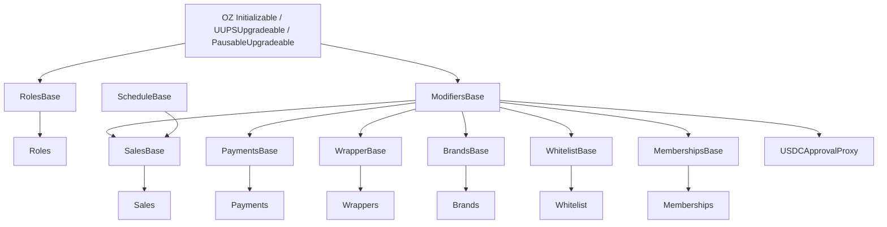
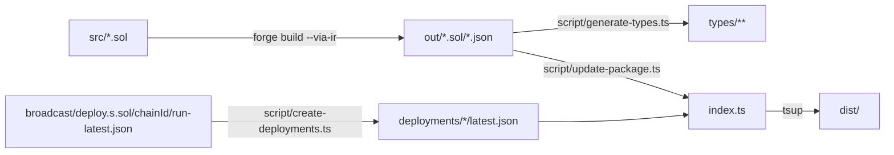

# 02 — Architecture

Eight contracts are deployed, each behind its own ERC1967 UUPS proxy, and each holds a single stored
reference: the address of the `Roles` contract. Everything else is resolved dynamically through
`roles.getRoleAddress(<ROLE>)`, which means a contract can be replaced by granting its role to a new
address without touching the callers. Logic is split in two layers by convention: an abstract base in
`src/abstracts/` holding `internal` business logic, and a concrete contract in `src/` holding the
external surface, the modifiers and the upgrade authorization.

Last verified against commit: 136615be21009eb2ea72a249527f07e2c1c61ab3

## Contracts and responsibilities

| Contract | Base | Responsibility |
| --- | --- | --- |
| `src/Roles.sol` | `abstracts/RolesBase.sol` | Role grants, primary address per role, delegation flags, payment-token registry |
| `src/Sales.sol` | `abstracts/SalesBase.sol` + `abstracts/ScheduleBase.sol` | Listing lifecycle, drop schedules, sale durations |
| `src/Payments.sol` | `abstracts/PaymentsBase.sol` | Fee configuration, fee splitting, ERC-20 settlement |
| `src/Wrappers.sol` | `abstracts/WrapperBase.sol` | Wrapper ERC-721, collections, import/export, marketplace custody |
| `src/Brands.sol` | `abstracts/BrandsBase.sol` | Soulbound brand ERC-721 |
| `src/Whitelist.sol` | `abstracts/WhitelistBase.sol` | Address allow-list |
| `src/Memberships.sol` | `abstracts/MembershipsBase.sol` | Membership tier per address |
| `src/USDCApprovalProxy.sol` | — (uses `ModifiersBase` directly) | Forwards ERC-2612 permits to the USDC token |

`src/abstracts/ModifiersBase.sol` is inherited by every contract except `Roles`. It holds the `IRoles`
reference, the per-user nonce map, the EIP-712 domain separator, all shared modifiers and the shared
error set. `src/abstracts/ScheduleBase.sol` is inherited only by `Sales`.

## Inheritance

`Roles` does not inherit `ModifiersBase`: it *is* the authority, and uses OpenZeppelin's
`AccessControlUpgradeable` modifiers directly.

## Runtime dependency graph

At call time, `Sales` and `Payments` are the only contracts that call peers.

| Caller | Callee | Resolved via | Purpose |
| --- | --- | --- | --- |
| `Sales` | `Wrappers` | `roles.getRoleAddress(WRAPPERS)` | `getWrapperData`, `ownerOf`, `marketplaceTransfer` |
| `Sales` | `Payments` | `roles.getRoleAddress(PAYMENTS)` | `splitServiceFee`, `splitFees` |
| `Sales` | `Whitelist` | `roles.getRoleAddress(WHITELIST)` | seller whitelist check on purchase |
| `Payments` | `Memberships` | `roles.getRoleAddress(MEMBERSHIPS)` | `getMemberships` for the fee tier |
| any | `Whitelist` | `onlyWhitelisted` modifier | caller allow-list |
| any | `Roles` | stored `roles` | `hasRole`, `hasDelegateRole`, `hasPaymentRole` |

`Payments.splitFees` and `Payments.splitServiceFee`, and `Wrappers.marketplaceTransfer`, are guarded by
`onlyDelegatedRole`: the caller contract must carry the delegation flag set through
`Roles.grantDelegateRole`. That is what lets `Sales` move other people's NFTs and pull their tokens.

## Proxy topology

Every contract is deployed as implementation plus `ERC1967Proxy` in `script/deploy.s.sol`. Upgrades go
through UUPS (`upgradeToAndCall` on the proxy), authorized by `_authorizeUpgrade` with
`onlyRole(UPGRADER)`. There is no ProxyAdmin and no TransparentUpgradeableProxy in the deployment path.

Deployment order matters because `Roles` must exist before anything else can be initialized:

1. Deploy all eight implementations (`_deployImplementations`).
2. Deploy the `Roles` proxy with the admin, USDC address, operational addresses and the user role list
   (`_deployRolesWithMinimalSetup`). Contract roles are intentionally left empty at this point.
3. Deploy the other seven proxies, each initialized with the `Roles` proxy address
   (`_deployOtherContractsWithCorrectRoles`). `Brands` also registers the first brand to the owner.
4. Grant the contract roles (`WHITELIST`, `WRAPPERS`, `BRANDS`, `PAYMENTS`, `SALES`, `MEMBERSHIPS`) and
   the delegate flags for `Wrappers`, `Payments` and `Sales` (`_grantContractRoles`).

## Build topology

The Solidity artifacts feed the TypeScript package; there is no reverse dependency.

`npm run build` runs these in order: `forge build --via-ir`, `tsup`, `generate-types`,
`create-deployments`, `update-package`.

## Open questions / unverified

- `script/deploy.s.sol` grants a `SALES` role to the Sales proxy, but no contract reads
  `roles.getRoleAddress(SALES)`; the grant appears to be defensive rather than functional.
- `test/Crutrade.t.sol` grants a `USDCPROXY` role to the `USDCApprovalProxy`; that role name does not
  appear in `src/` and the deployment script does not grant it.
