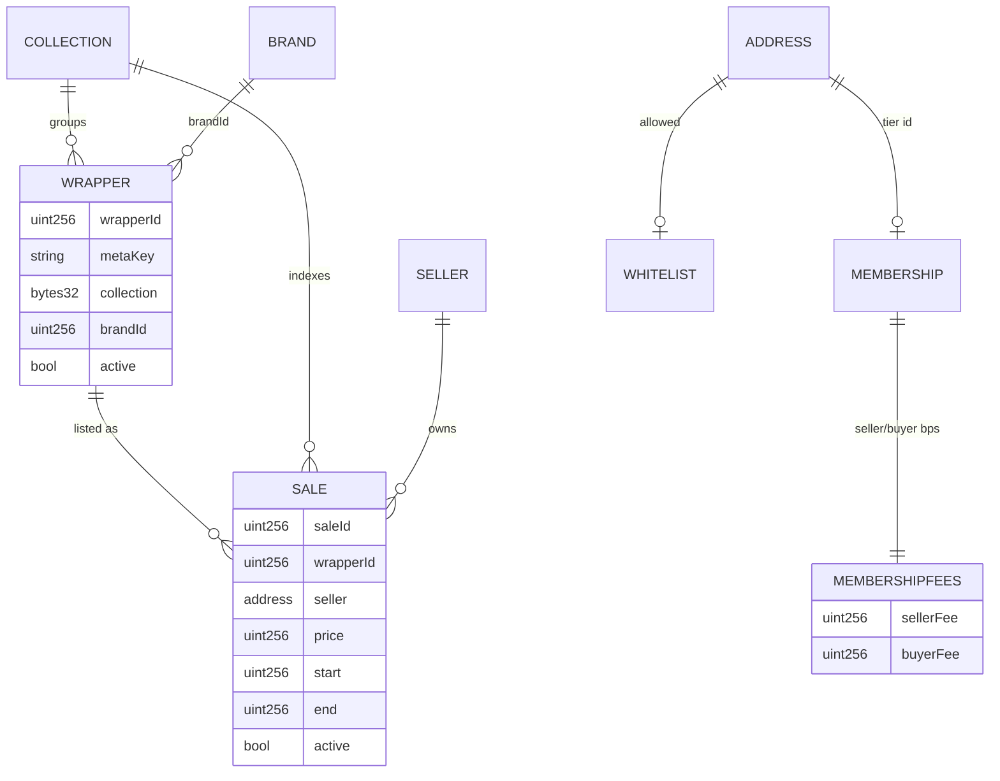

# 03 — Data model

There is no database. All state lives in the storage of eight upgradeable proxies. This chapter lists
the storage layout of each, the structs they hold, the relations between them and the rules that keep
upgrades safe. Layouts were read with `forge inspect <Contract> storage-layout`; OpenZeppelin v5
upgradeable base contracts use ERC-7201 namespaced storage, which is why the project's own variables
start at slot 0.

Last verified against commit: 136615be21009eb2ea72a249527f07e2c1c61ab3

## Shared prefix

Every contract except `Roles` inherits `src/abstracts/ModifiersBase.sol`, which occupies slots 0-3 in
all of them:

| Slot | Type | Name | Purpose |
| --- | --- | --- | --- |
| 0 | `IRoles` | `roles` | Address of the `Roles` proxy |
| 1 | `mapping(bytes32 => bool)` | `_usedHashes` | Replay guard for `checkFrontendSignature`; currently unused |
| 2 | `mapping(address => uint256)` | `_nonces` | Per-user EIP-712 nonce, read via `getNonce(address)` |
| 3 | `bytes32` | `_domainSeparator` | EIP-712 domain separator, fixed at initialization |

The domain separator binds `name`, `version`, `block.chainid` and `address(this)`. Because it is
computed once in `__ModifiersBase_init` and stored, a chain fork would not invalidate it.

## Roles (`src/Roles.sol`)

| Slot | Type | Name |
| --- | --- | --- |
| 0 | `mapping(address => Payment)` | `_payments` |
| 1 | `mapping(address => bool)` | `_delegated` |
| 2 | `mapping(bytes32 => address)` | `_primaryAddresses` |
| 3 | `address` | `_defaultFiatToken` |

`Payment` (`src/interfaces/IRoles.sol`) is `{ uint8 decimals; bool isConfigured; }`. Role membership
itself is held by OpenZeppelin's `AccessControlUpgradeable` in its own namespaced slot, not here;
`_primaryAddresses` is an additional single-address index per role that `_grantRole` and `_revokeRole`
keep in sync.

## Sales (`src/Sales.sol`)

| Slot | Type | Name | Notes |
| --- | --- | --- | --- |
| 4 | `mapping(uint256 => Schedule)` | `_schedules` | from `ScheduleBase` |
| 5 | `uint256` | `_scheduleCount` | upper bound of the schedule scan |
| 6 | `uint256` | `_listingDelay` | fallback when no schedule is active |
| 7 | `mapping(uint256 => uint256)` | `_durations` | duration id to seconds |
| 8 | `mapping(uint256 => Sale)` | `_salesById` | primary sale record |
| 9 | `mapping(bytes32 => UintSet)` | `_saleIdsByCollection` | index: collection to sale ids |
| 10 | `mapping(address => UintSet)` | `_saleIdsBySeller` | index: seller to sale ids |
| 11 | `uint256` | `_maxDurationId` | validation bound for duration ids |
| 12 | `uint256` | `_nextSaleId` | starts at 1 |

`ISales.Sale` is `{ uint256 end; uint256 start; uint256 price; uint256 wrapperId; address seller; bool active; }`.
`Schedule` is `{ uint8 dayOfWeek; uint8 hour; uint8 minute; bool isActive; }` with `dayOfWeek` 1-7,
Monday to Sunday.

Index maintenance: both `EnumerableSet.UintSet` indexes are added to on `list` and removed from on
`buy` and `withdraw`. `withdraw` additionally `delete`s the `_salesById` entry; `buy` leaves the record
with `active == false` so the sale stays queryable by id. `renew` touches neither index.

## Payments (`src/Payments.sol`)

| Slot | Type | Name |
| --- | --- | --- |
| 4 | `uint256` | `_fiatFeePercentage` |
| 5 | `Fee[]` | `_fees` |
| 6 | `mapping(bytes32 => uint256)` | `_feeIndices` |
| 7 | `mapping(bytes32 => uint256)` | `_serviceFees` |
| 8 | `mapping(uint256 => MembershipFees)` | `_membershipFees` |

`Fee` is `{ bytes32 name; uint256 percentage; address wallet; }`; `MembershipFees` is
`{ uint256 sellerFee; uint256 buyerFee; }`. All percentages are basis points against
`BPS = 10000`. `_feeIndices` stores a 1-based index into `_fees` so that 0 means "absent";
`_removeFee` swaps the last element into the hole and repairs the index.

`_fees[0]` is special: `_processServiceFeeTransfers` reads `_fees[0].wallet` as the treasury. The
initializer pushes the `TREASURY` fee first, so position 0 must not be removed or reordered.

## Wrappers (`src/Wrappers.sol`)

| Slot | Type | Name |
| --- | --- | --- |
| 4 | `uint256` | `_nextWrapperId` |
| 5 | `string` | `_httpsBaseURI` |
| 6 | `mapping(uint256 => WrapperData)` | `_wrappersById` |
| 7 | `mapping(bytes32 => UintSet)` | `_wrappersByCollection` |

`IWrappers.WrapperData` is
`{ string uri; string metaKey; uint256 amount; uint256 tokenId; uint256 brandId; bytes32 collection; bool active; }`.
`collection == bytes32(0)` is the "does not exist" sentinel used by `getWrapperData`, `tokenURI` and
`marketplaceTransfer`. A comment at `src/abstracts/WrapperBase.sol` records that a `_baseURIString`
variable was deliberately removed and that `_httpsBaseURI` now serves both purposes, to preserve the
layout of the deployed contract.

## Brands, Whitelist, Memberships, USDCApprovalProxy

| Contract | Slot 4 | Slot 5 |
| --- | --- | --- |
| `Brands` | `uint256 _nextBrandId` | `string _baseURIString` |
| `Whitelist` | `mapping(address => bool) _whitelisted` | — |
| `Memberships` | `mapping(address => uint256) _memberships` | — |
| `USDCApprovalProxy` | `address usdcToken` (public) | `address paymentsContract` (public) |

In `Memberships`, id `0` doubles as "no membership": `_revokeMembership` reverts with
`MembershipNotFound` when the stored id is 0, and `Payments` looks up `_membershipFees[0]` for anyone
without a tier. Tier 0 is therefore the default fee tier, not an empty one.

## Entity relations

`brandId` on a wrapper is stored but never validated against the `Brands` contract on import; the
`onlyAllowedBrand` modifier exists in `ModifiersBase` and is not applied anywhere.

## Migration strategy

There are no migrations in the database sense. State changes arrive through UUPS upgrades, so the
storage layout is the schema and it is append-only:

- Adding a variable to any `src/abstracts/*Base.sol` shifts every slot below it. No base declares a
  `__gap`, so this is a live-data corruption, not a compile error. Append to the most-derived contract.
- Never reorder, retype or delete an existing variable.
- `foundry.toml` sets `build_info = true` and `extra_output = ["storageLayout"]`, and
  `@openzeppelin/foundry-upgrades` is available, so `Upgrades.upgradeProxy` can validate a layout.
  `script/safe-upgrade-v1.5.0-oz-foundry.s.sol` is the example that uses it; the other two upgrade
  scripts perform a raw `upgradeToAndCall` with no layout validation.
- Verify manually before any upgrade: `forge inspect <Contract> storage-layout` on both the deployed
  and the new implementation, and diff.

## Open questions / unverified

- `src/Wrappers.sol` carries `@custom:oz-upgrades-from src/old/Wrappers.sol:Wrappers`, but `src/old/`
  does not exist in this repository, so the OpenZeppelin upgrade validator cannot resolve the
  reference from this checkout.
- The `amount` field of `WrapperData` is stored as 0 by `_processSingleImport` and never read; its
  intended meaning is not determinable from the code.
