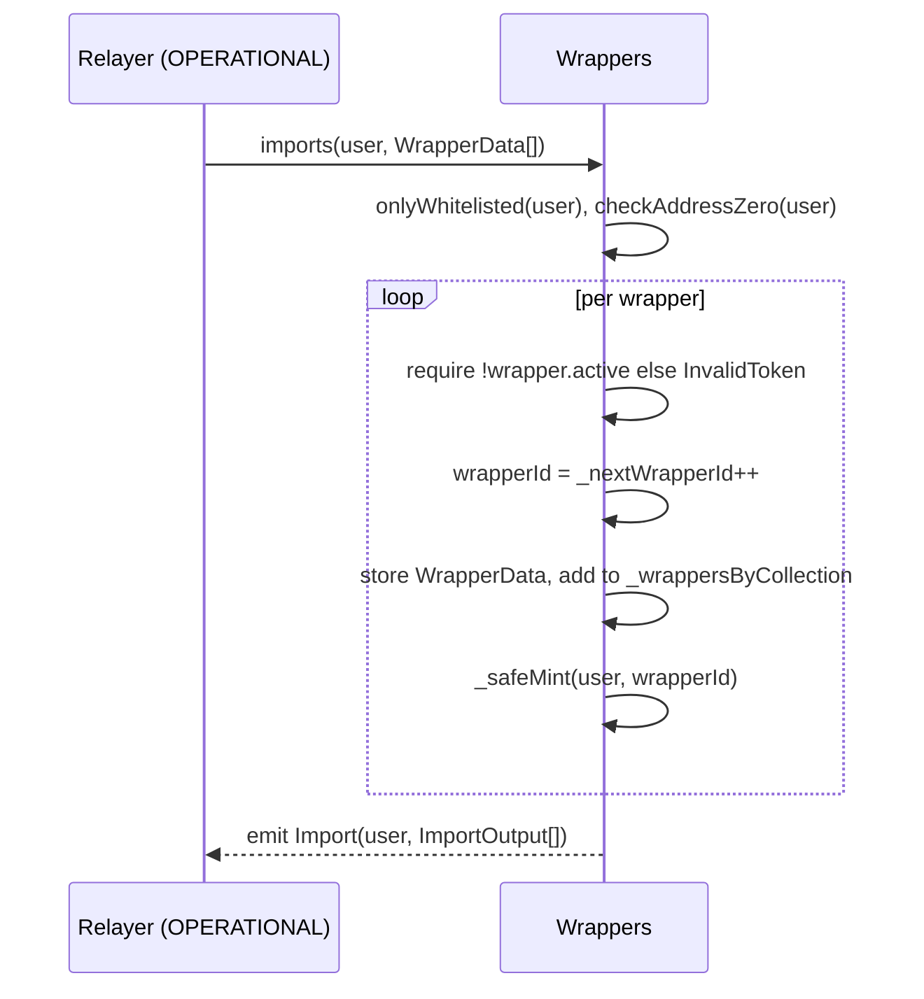
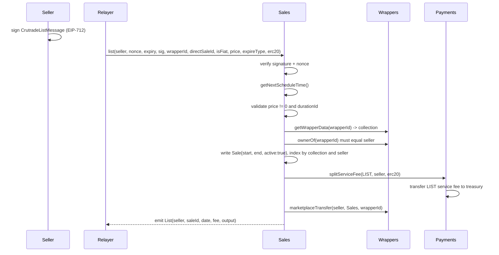
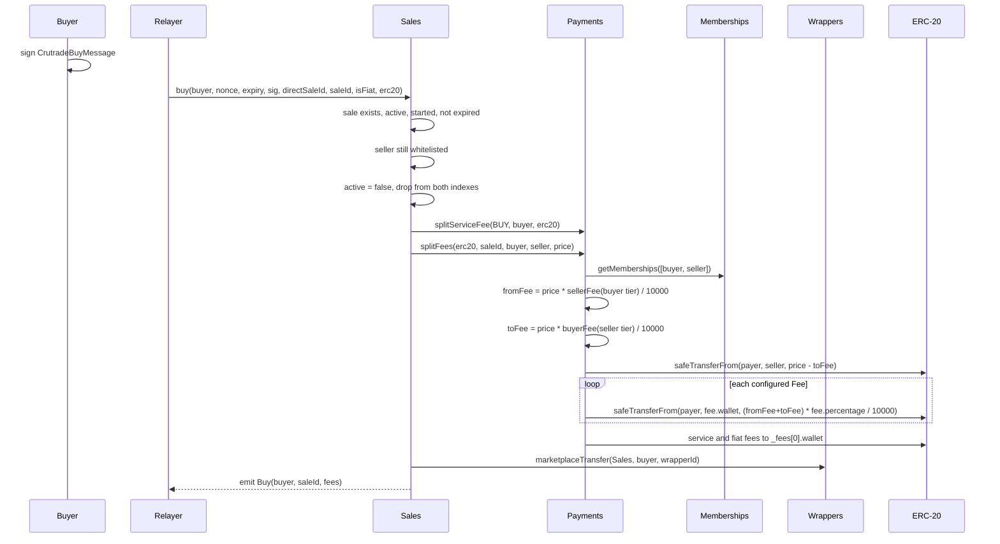
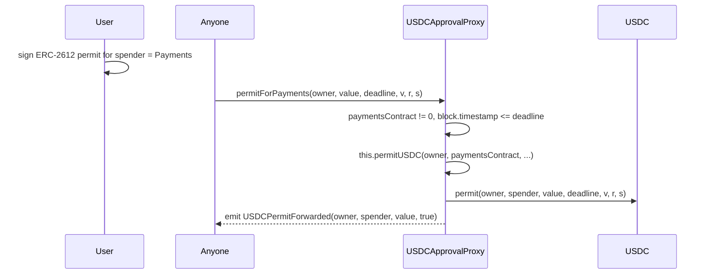

# 04 — Core flows

Every user-facing operation follows the same shape: the user signs an EIP-712 payload off-chain, a
backend account holding the `OPERATIONAL` role submits it, the contract verifies the signature against
the user's current nonce, then executes. The user never sends a transaction and never pays gas. This
chapter traces the five flows that move value or custody.

Last verified against commit: 136615be21009eb2ea72a249527f07e2c1c61ab3

## Common preconditions

For `list`, `buy`, `withdraw` and `renew` in `src/Sales.sol`, all of these must hold:

| Check | Modifier / code | Failure |
| --- | --- | --- |
| Contract not paused | `whenNotPaused` | `EnforcedPause` |
| No re-entry | `nonReentrant` | `ReentrancyGuardReentrantCall` |
| Caller is the relayer | `onlyRole(OPERATIONAL)` | `NotAllowed(role, account)` |
| User is whitelisted | `onlyWhitelisted(wallet)` | `NotWhitelisted(wallet)` |
| Signature not expired | `block.timestamp > expiry` | `SignatureExpired(expiry, current)` |
| Nonce matches | `nonce != _nonces[wallet]` | `InvalidNonce(expected, provided)` |
| Signature recovers to the user | `ECDSA.recover` | `InvalidSignature(expected, actual)` |

On success the modifier increments `_nonces[wallet]` and emits `NonceUsed`.

## Import: minting a wrapper

`exports` is the inverse: it flips `active` to false and removes the id from the collection index, but
it does **not** burn the token. The holder keeps the ERC-721 after export.

## List: putting a wrapper on sale

`start` is the next scheduled drop time, not `block.timestamp`, so a listing is dormant until the
window opens. `end` is `start + _durations[expireType]`.

## Buy: settling a sale

Note the argument order in `Payments.splitFees`: `from` is the buyer and `to` is the seller, so
`fromMembershipFees.sellerFee` is looked up from the **buyer's** tier and `toMembershipFees.buyerFee`
from the **seller's** tier (`src/Payments.sol`, `splitFees`). The buyer must have approved `Payments`
for `price - toFee` plus all fee transfers before the call.

## Withdraw and renew

`withdraw` cancels an active, started, unexpired sale for its own seller: it flips `active` to false,
removes both index entries, deletes the sale record, charges the `WITHDRAW` service fee and returns the
wrapper from `Sales` to the seller.

`renew` moves an **expired** sale to the next drop window. It requires `block.timestamp >= sale.end`
(`SaleNotExpired` otherwise), charges the `RENEW` service fee, and rewrites `start` to the next
schedule time and `end` to `start + (old end - old start)`, preserving the original duration. The
wrapper stays in `Sales` custody and the indexes are untouched.

## Fiat path

Passing `erc20 == address(0)` marks a fiat-settled operation:

1. `Payments` substitutes `roles.getDefaultFiatPayment()` as the token to move.
2. The payer becomes `roles.getRoleAddress(FIAT)` instead of the user, so the platform's fiat account
   funds the on-chain leg.
3. `splitServiceFee` adds `serviceFees * _fiatFeePercentage / 10000` as `fiatFees`, and `splitFees`
   adds `amount * _fiatFeePercentage / 10000`, both transferred to `_fees[0].wallet`.

The `onlyValidPayment` modifier explicitly allows `address(0)` through; any other token must be
registered with `Roles.setPayment`.

## Permit forwarding

`permitUSDC` and `permitForPayments` carry no access-control modifier: anyone may submit a permit, which
is standard for ERC-2612 relays since the signature itself is the authorization.

## Open questions / unverified

- `directSaleId` is part of every signed payload and every function signature in `Sales`, but is never
  stored, validated or emitted. Its purpose is presumably off-chain correlation; nothing in this
  repository confirms that.
- `isFiat` is part of the signed payload but the contract derives the fiat path solely from
  `erc20 == address(0)`. A signature could therefore claim `isFiat = true` while the relayer passes a
  real token address, and nothing rejects the mismatch.
